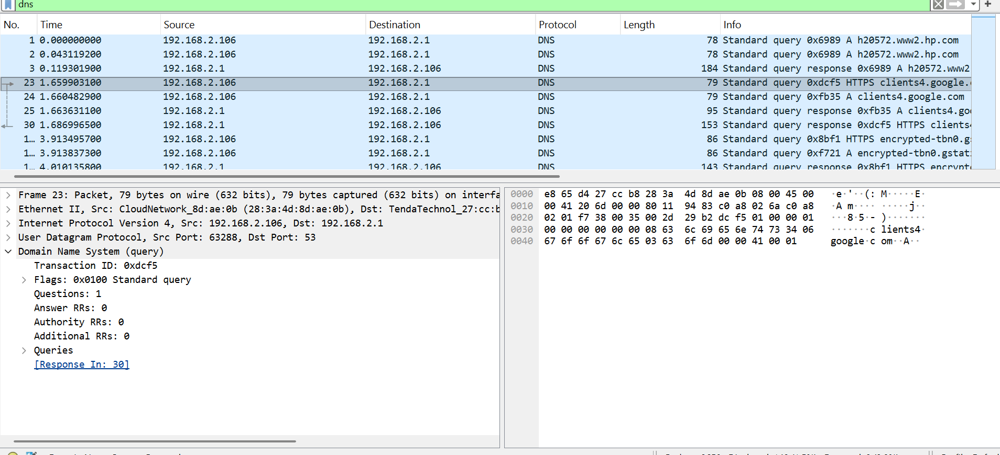
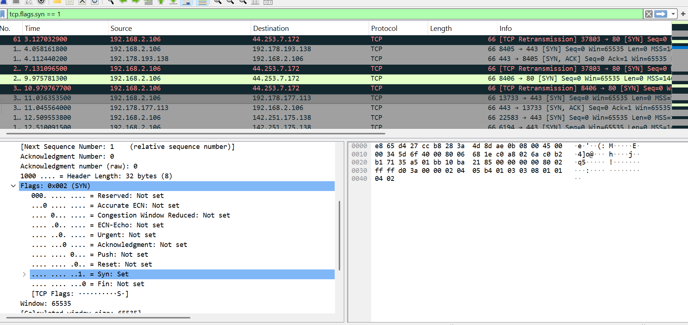
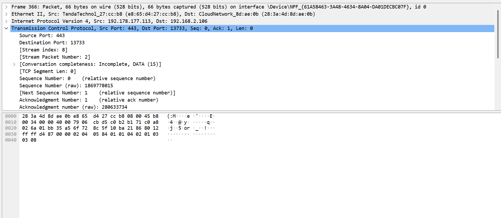
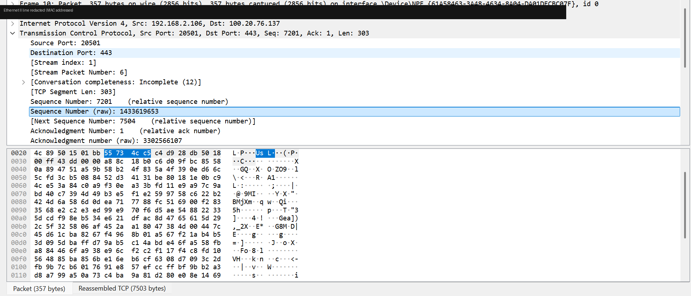

# Project 1: Wireshark Packet Capture Analysis

## Overview
I captured live traffic from my own home network using Wireshark and analyzed it to identify three core elements of network communication: a DNS lookup, a TCP three-way handshake, and encrypted HTTPS data in transit. The goal was to move from theoretical knowledge of networking protocols to actually recognizing them in raw packet captures — the same skill a SOC Analyst uses when reviewing suspicious or unfamiliar traffic.

**Tool used:** Wireshark
**Capture environment:** Home network (WiFi interface)

---

## 1. DNS Query Analysis

**Filter used:** `dns`

While browsing normally, I captured a DNS query for `clients4.google.com`. The packet shows my machine (192.168.2.106) sending a standard query to my router (192.168.2.1), which acts as the DNS resolver for my network.

**What the packet shows:**
- Source: 192.168.2.106 (my machine) → Destination: 192.168.2.1 (router/resolver)
- Protocol: DNS over UDP, destination port 53
- Transaction ID: 0xdcf5
- Query type: HTTPS record for `clients4.google.com`

This confirms the DNS resolution process in practice — before my browser could connect to Google's servers, it first had to resolve the domain name into a usable address.

---

## 2. TCP Three-Way Handshake

**Filter used:** `tcp.flags.syn == 1`

**Step 1 — SYN (client → server):**
My machine (port 13733) sent a SYN packet to a remote server on port 443, with Sequence Number 0 — the start of a new connection request.

**Step 2 — SYN, ACK (server → client):**
The server responded on port 443 back to my machine's port 13733, with `Ack: 1` — acknowledging my SYN and completing the second step of the handshake.

I also expanded the raw Flags field on a SYN packet to confirm it at the byte level:

**Bonus finding — a failed connection attempt:**
The same capture also showed a `[TCP Retransmission]` entry — a SYN packet sent to port 80 that never received a response, so Wireshark automatically flagged and retransmitted it. An unanswered SYN can indicate a blocked port, an unreachable host, or in a security context, something worth investigating if it happens repeatedly toward a sensitive port.

---

## 3. Encrypted HTTPS Traffic

**Filter used:** `tcp.port == 443`

I captured a packet showing 303 bytes of TCP segment data moving over port 443 with an advancing sequence number — confirming an active, encrypted HTTPS session in progress. Since the traffic is encrypted (TLS), the content isn't readable, which is expected — this demonstrates the ability to confirm a secure session is active and data is flowing, even without reading its contents.

---

## What This Project Demonstrates

- Installing, configuring, and using Wireshark to capture live network traffic
- Applying display filters (`dns`, `tcp.flags.syn == 1`, `tcp.port == 443`) to isolate relevant traffic
- Reading packet details: source/destination IPs, ports, sequence/acknowledgment numbers, and TCP flags
- Recognizing a complete TCP three-way handshake versus a failed/retransmitted connection attempt
- Understanding the difference between readable (DNS) and encrypted (TLS/HTTPS) traffic at the packet level

This is a foundational skill for a SOC Analyst role, where traffic analysis is used daily to investigate alerts and distinguish normal traffic from suspicious patterns.
